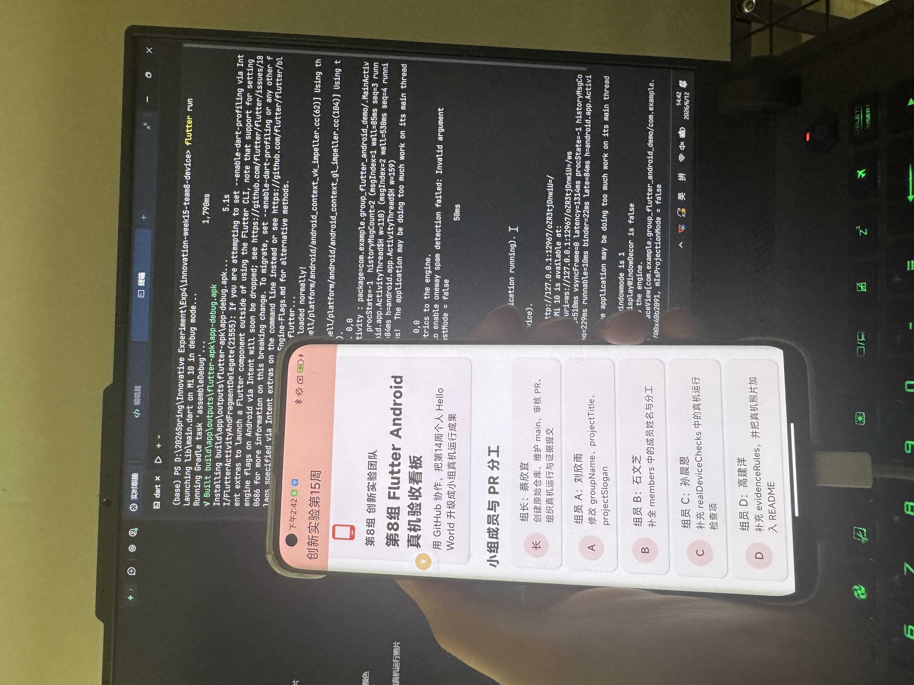

# 第8组创新实验第15周成果

## 小组成员

| 角色   | 姓名  | 任务                                      | PR 链接  |
| ---- | --- | --------------------------------------- | ------ |
| 组长   | 蔡欣宜 | 创建原始仓库、维护 main、审核 PR、组织真机运行与证据提交        | <br /> |
| 组员 A | 刘欣雨 | 修改 groupName、projectTitle、projectSlogan | [PR #2](https://github.com/gulangqingcheng/innovation-week15-team8-device/pull/2) |
| 组员 B | 石文芝 | 补全 members 中的成员姓名与分工                    | [PR #3](https://github.com/gulangqingcheng/innovation-week15-team8-device/pull/3) |
| 组员 C | 孙晨恩 | 补充 realDeviceChecks 中的真机运行检查项           | [PR #4](https://github.com/gulangqingcheng/innovation-week15-team8-device/pull/4) |
| 组员 D | 高建洋 | 补充 evidenceRules，并把真机照片加入 README        | 待提交 |
## Android 真机运行

- 手机型号：Mi 10
- 运行方式：flutter run
- 运行日期：2026-06-12 2:42pm



## 协作流程

1. 组长创建原始仓库
2. 组员 Fork 到自己的 GitHub
3. 组员 clone 自己的 Fork
4. 组员修改指定区域后 push
5. 组员向组长仓库提交 Pull Request
6. 组长 Review 并合并
7. 主电脑运行合并后的最终版本

## 运行命令

```bash
flutter pub get
flutter devices
flutter run -d 设备ID
```

